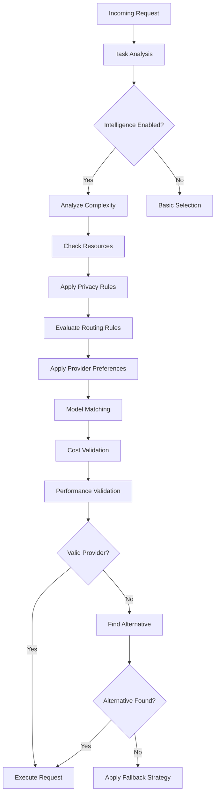

# Hybrid Orchestrator Architecture

## Overview

The Hybrid Orchestrator is an intelligent routing system that automatically selects the best AI provider (local or cloud) for each request based on multiple factors including task complexity, system resources, cost constraints, and performance requirements.

## Architecture Components

### 1. Core Orchestrator Layers

```
┌─────────────────────────────────────────────────────────────┐
│                   ConfigurableOrchestrator                   │
│  (Configuration Management + Rule Engine + API Endpoints)    │
├─────────────────────────────────────────────────────────────┤
│                   IntelligentOrchestrator                    │
│     (Intelligence Layer Integration + Smart Routing)         │
├─────────────────────────────────────────────────────────────┤
│                     HybridOrchestrator                       │
│        (Base Provider Management + Load Balancing)           │
└─────────────────────────────────────────────────────────────┘
```

### 2. Intelligence Layer Components

#### Task Analyzer
- Analyzes prompt complexity (1-10 scale)
- Detects task types (code, creative, analysis, etc.)
- Estimates token requirements
- Identifies special needs (vision, functions)

#### Model Matcher
- Matches models to task requirements
- Scores providers based on capabilities
- Considers size appropriateness
- Applies preferences and constraints

#### Cost Optimizer
- Estimates costs for each provider
- Tracks usage and budgets
- Optimizes selection by cost-effectiveness
- Supports various budget constraints

#### Performance Predictor
- Predicts latency based on task and provider
- Learns from historical data
- Calculates reliability scores
- Provides confidence levels

#### Resource Monitor
- Real-time CPU and memory monitoring
- GPU detection and tracking
- Resource-based recommendations
- Alert system for constraints

### 3. Configuration System

#### Configuration Manager
- JSON-based configuration
- Hot-reloading support
- Schema validation with Zod
- Version control friendly

#### Rule Engine
- Evaluates routing rules
- Applies provider preferences
- Enforces privacy settings
- Validates constraints

## Configuration Schema

### Provider Preferences
```json
{
  "providers": [
    {
      "name": "Ollama",
      "priority": 80,
      "enabled": true,
      "costMultiplier": 1.0,
      "conditions": {
        "taskTypes": ["code", "analysis"],
        "complexityRange": { "min": 1, "max": 7 },
        "timeOfDay": { "start": "09:00", "end": "17:00" }
      }
    }
  ]
}
```

### Routing Rules
```json
{
  "routingRules": [
    {
      "id": "prefer-local-privacy",
      "name": "Use Local for Private Data",
      "priority": 90,
      "enabled": true,
      "conditions": {
        "promptPattern": "(personal|private|confidential)",
        "complexity": { "max": 8 }
      },
      "actions": {
        "requiredProviderType": "local",
        "maxCost": 0.10
      }
    }
  ]
}
```

### Cost Limits
```json
{
  "costLimits": {
    "maxCostPerRequest": 1.0,
    "maxCostPerDay": 100.0,
    "warningThreshold": 0.8,
    "actionOnLimit": "fallback"
  }
}
```

### Privacy Settings
```json
{
  "privacySettings": {
    "mode": "balanced",
    "allowCloudProviders": true,
    "requireEncryption": true,
    "excludeProviders": ["provider-name"]
  }
}
```

## Routing Decision Flow



## API Endpoints

### Configuration Management

#### GET /api/config
Get current orchestrator configuration

#### PUT /api/config
Update orchestrator configuration

#### GET /api/config/rules
Get all routing rules

#### POST /api/config/rules
Add a new routing rule

#### PUT /api/config/rules/:id
Update existing routing rule

#### DELETE /api/config/rules/:id
Delete routing rule

#### GET /api/config/providers
Get provider preferences

#### PUT /api/config/providers/:name
Update provider preference

### Intelligence Reports

#### GET /api/intelligence/report
Get comprehensive intelligence report including:
- Task analysis statistics
- Performance metrics
- Cost tracking
- Resource utilization
- Recommendations

## Best Practices

### 1. Routing Rules

**DO:**
- Create specific rules for sensitive data handling
- Use complexity ranges to match model sizes
- Set reasonable priority levels (0-100)
- Test regex patterns before deployment

**DON'T:**
- Create overlapping rules without clear priorities
- Use overly broad patterns that match everything
- Disable logging for troubleshooting

### 2. Provider Configuration

**DO:**
- Set appropriate priorities based on capabilities
- Use time-based conditions for load distribution
- Configure cost multipliers for accurate budgeting
- Enable/disable providers based on availability

**DON'T:**
- Set all providers to the same priority
- Ignore cost implications of cloud providers
- Disable all local providers in production

### 3. Performance Tuning

**DO:**
- Monitor resource usage regularly
- Set realistic latency targets
- Use caching for repeated queries
- Enable performance prediction learning

**DON'T:**
- Set impossibly low latency requirements
- Ignore resource monitoring alerts
- Disable fallback mechanisms

### 4. Cost Management

**DO:**
- Set appropriate budget limits
- Monitor usage trends
- Use warning thresholds (e.g., 80%)
- Prefer local providers for high-volume tasks

**DON'T:**
- Operate without cost limits
- Ignore cost optimization opportunities
- Set limits too low for operational needs

## Troubleshooting

### Common Issues

#### "No healthy providers available"
- Check provider health endpoints
- Verify services are running (Ollama, LM Studio, etc.)
- Review provider configuration

#### "Provider exceeds cost limit"
- Check cost configuration
- Review cost multipliers
- Consider increasing limits or using local providers

#### "High latency detected"
- Check system resources
- Verify network connectivity
- Review model sizes vs available resources

#### "Configuration not loading"
- Verify JSON syntax
- Check file permissions
- Review schema validation errors

### Debug Mode

Enable debug mode in configuration:
```json
{
  "debugMode": true
}
```

Or via environment variable:
```bash
DEBUG=orchestrator:* npm run dev
```

## Integration Examples

### Basic Usage
```typescript
const orchestrator = new ConfigurableOrchestrator({
  configPath: './config/orchestrator.json',
  autoReload: true
});

await orchestrator.initialize();
```

### Custom Routing Rule
```typescript
await orchestrator.addRoutingRule({
  id: 'gpu-for-images',
  name: 'Use GPU Provider for Images',
  priority: 85,
  enabled: true,
  conditions: {
    requiresVision: true
  },
  actions: {
    preferredProvider: 'LocalAI'
  }
});
```

### Provider Preference Update
```typescript
await orchestrator.updateProviderPreference('Ollama', {
  priority: 90,
  conditions: {
    complexityRange: { min: 1, max: 5 }
  }
});
```

## Monitoring and Metrics

The orchestrator tracks:
- Request routing decisions
- Provider performance metrics
- Cost accumulation
- Resource utilization
- Error rates and fallback usage

Access metrics via:
```bash
curl http://localhost:3000/api/intelligence/report
```

## Security Considerations

1. **Configuration Access**: Protect configuration endpoints with authentication
2. **Sensitive Patterns**: Be careful with regex patterns for sensitive data
3. **Provider Credentials**: Store API keys securely (not in config)
4. **Audit Logging**: Enable for compliance requirements
5. **Privacy Mode**: Use strict mode for sensitive environments

---

Last updated: 2025-01-19