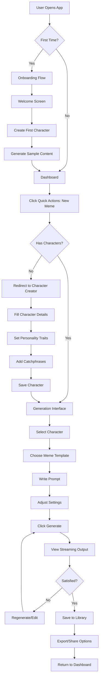

# User Flows - AI Content Studio

## Primary User Journey: Create Meme Content

## Character Creation Flow

### Happy Path
1. **Entry Points**
   - Dashboard → Characters → Create New
   - Quick Action → New Character
   - First-time onboarding

2. **Character Setup**
   - Upload/Select Avatar
   - Enter Basic Info (Name, Description)
   - Set Personality Sliders
   - Choose Voice Settings
   - Add Background Details
   - Define Knowledge Domains
   - Add Catchphrases

3. **Validation & Preview**
   - Real-time preview updates
   - Test generation with sample prompts
   - Consistency check warnings
   - Save draft option

4. **Completion**
   - Save character
   - Auto-redirect to generation
   - Success notification
   - Character appears in gallery

### Edge Cases
- **Duplicate Names**: Show warning, suggest variation
- **Incomplete Profile**: Allow save as draft
- **Import Failure**: Show error, maintain form data
- **Network Issues**: Local save, sync when online

## Content Generation Flow

### Quick Generation Path
1. User clicks "Quick Generate" from anywhere
2. System auto-selects last used character
3. User types prompt
4. Real-time token counter shows cost
5. Generate button enables when valid
6. Streaming response appears
7. Auto-save to library on completion

### Template-Based Generation
1. User browses template gallery
2. Filters by type (meme, video, social)
3. Selects template
4. Template loads with placeholders
5. User fills in variables
6. Character auto-applies their voice
7. Preview shows expected output
8. Generate creates all variations
9. User selects best version
10. Quick export to desired format

### Batch Generation Mode
1. User enters batch mode
2. Uploads CSV or enters multiple prompts
3. Selects characters for each (or auto-assign)
4. Sets global options
5. Reviews batch preview
6. Starts generation queue
7. Progress bar shows completion
8. Results appear in grid view
9. Bulk actions available (export all, filter, etc.)

## Memory Management Flow

### Adding Memories
1. **Automatic Path**
   - System detects important interactions
   - Suggests memory creation
   - User approves/edits/dismisses

2. **Manual Path**
   - User opens character profile
   - Clicks "Add Memory"
   - Categorizes (fact, preference, event)
   - Sets importance level
   - Memory added to timeline

### Memory Retrieval
1. During generation, system checks:
   - Relevant memories based on prompt
   - Recent interactions
   - High-importance memories
2. Injects appropriate context
3. Shows which memories were used
4. User can exclude specific memories

## Content Management Flow

### Organization
1. **Auto-Organization**
   - Content tagged by type on creation
   - Character association maintained
   - Timestamp and version tracking
   - Quality scores assigned

2. **Manual Organization**
   - Drag to folders
   - Multi-select for bulk actions
   - Create collections
   - Add custom tags

### Search & Filter
1. User enters search term
2. Real-time results appear
3. Filters sidebar shows:
   - Characters used
   - Content types
   - Date ranges
   - Quality ratings
   - Tags
4. Results update instantly
5. Save search as smart folder

## Export Workflow

### Single Item Export
1. User hovers over content
2. Export icon appears
3. Click shows format options
4. Platform-specific optimizations apply
5. Download starts or copy to clipboard
6. Success notification

### Bulk Export
1. Select multiple items
2. Choose export format
3. Set naming convention
4. Pick destination (local/cloud)
5. Progress bar shows status
6. ZIP file ready for download
7. Export log available

## Analytics Review Flow

1. **Dashboard Overview**
   - Key metrics at a glance
   - Trend indicators
   - Alerts for anomalies

2. **Drill-Down Analysis**
   - Click metric for details
   - Time range selector
   - Compare periods
   - Filter by character/type

3. **Report Generation**
   - Select metrics to include
   - Choose visualization style
   - Add comments/insights
   - Schedule recurring reports
   - Export as PDF/CSV

## Error Handling Flows

### Generation Failure
1. Error notification appears
2. Specific error message shown
3. Suggested actions:
   - Try different model
   - Reduce prompt length
   - Check character settings
4. One-click retry available
5. Report issue option

### Character Consistency Warning
1. System detects drift
2. Warning icon on character
3. User clicks for details
4. Shows specific issues
5. Options to:
   - Adjust recent content
   - Update character profile
   - Ignore warning
   - Reset to baseline

## Collaboration Flows

### Sharing Content
1. User selects content
2. Clicks share button
3. Options appear:
   - Get link
   - Invite collaborators
   - Set permissions
   - Add to team library
4. Link copied with expiry options
5. Activity tracked in log

### Team Character Management
1. Admin creates team workspace
2. Invites team members
3. Sets role permissions
4. Creates shared characters
5. Team members can:
   - Use characters
   - Suggest edits
   - View analytics
   - Cannot delete/major edit
6. Change requests go to admin
7. Version control maintains history

## Mobile-Specific Flows

### Quick Capture
1. User opens mobile app
2. Bottom tab shows camera icon
3. Tap to capture image/idea
4. Add quick note
5. Auto-saved to inbox
6. Process later on desktop

### Voice Input
1. Tap microphone icon
2. Speak prompt naturally
3. Real-time transcription
4. Edit if needed
5. Generate on-the-go
6. Save for later refinement

## Onboarding Flow

### First-Time User
1. **Welcome Screen**
   - Value proposition
   - Key features preview
   - Start button

2. **Account Setup**
   - Basic info
   - Choose interests
   - Select content types

3. **First Character**
   - Guided character creation
   - Pre-filled suggestions
   - Interactive tutorial

4. **First Generation**
   - Sample prompt provided
   - Walk through options
   - Generate example
   - Show possibilities

5. **Dashboard Tour**
   - Highlight key areas
   - Show where to find help
   - Enable notifications
   - Complete onboarding

### Power User Onboarding
1. Skip basic tutorials
2. Import existing data
3. Advanced settings access
4. API key setup
5. Keyboard shortcuts guide
6. Direct to dashboard